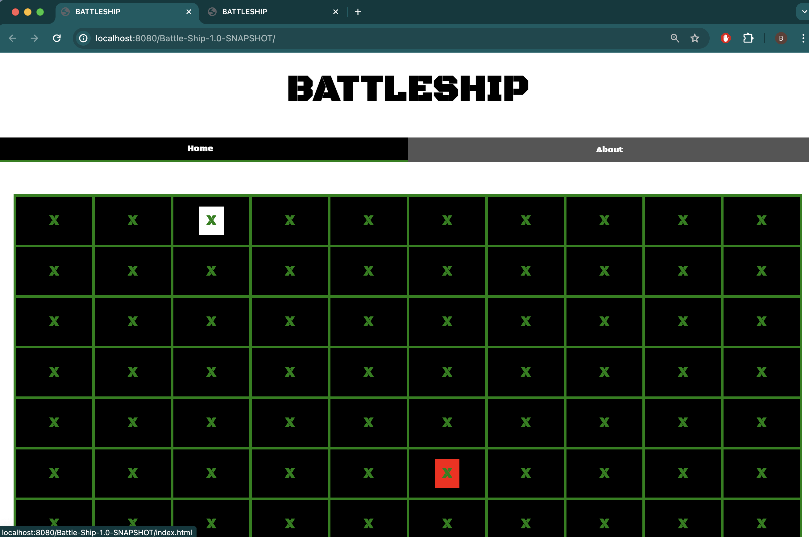

# FINAL PROJECT
Software Systems Development and Integration
CSCI2020U - Winter 2024

# 1. ------- PROJECT INFORMATION --------

Group Members: Jacob Rempel, Ryan Warrener, Bilal Nazar

Within this project, we were able to establish a BattleShip game that is able to handle 2 clients. The game
gives a preset list of options for users to choose how to lay out their ships on the game board. Afterward, the
players take turns at destroying each others ships. The game ends once a user has destroyed all the opponents
ships. The game board will display whether the user has hit its opponent ship (turning the box red) or whether
it has missed (turning the box white). The user/client interacts with a beautifully displayed UI that follows a
military theme allowing the user to immerse in a warfare/battlefield experience. 

# 2. ---------- HOW TO RUN --------------

### Step 1)
Open the GitHub of the assignment and copy the link of the assignment code.

### Step 2)
First find a suitable folder to store the assignment code. After, open your computers terminal and type 
the git command "git clone + [link]". (Place the copied link from GitHub in the position of [link])

### Step 3) 
After successfully loading the assignment folder, the main files are located in:  
w24-csci2020u-final-project-nazar-warrener-rempel/src/main/java/rempelnazarwarrener/battleship/BattleShip.java

Once in the project, edit the Run Configurations of the file by setting up a Local Glassfish Server running 
GlassFish 7.0.11. Then assign the JRE to JDK 21, specify the Domain as domain1, set up the initial URL to be
http://localhost:8080/Battle-Ship-1.0-SNAPSHOT/. Then go to Deployment and select the artifact "Battle-Ship: war exploded". 
Finally, apply and save these changes.

### Step 4)
Click Run File. The Server would have successfully opened, automatically displaying the index.html file.

### Step 5)
Begin by clicking on the button "Player 1", then open a new tab and copy and paste the URL to the search bar.
Then click on "Player 2". The game won't start until both players have joined.

### Step 6)
Afterward, the user will have a popup displayed outlining the different "BattlePlans" the user can select from,
for the placement of their ships. Each player must select a "BattlePlan" for the game to continue. After the
users have chosen their "BattlePlans", the application will display a grid for each user. The players then
interact with the grids, each taking turns.

### Step 7)
When a user clicks on an "X" the board will respond, displaying if the user made a successful shot. If the user
was able to hit an opponents ship, the "X" will turn red and the user will be able to take another turn. 
However, if the user missed a shot the "X" will turn white and the opponent can take their turn.

### Step 8) 
The game will continue until a player has sunken all of its opponents ships. Afterward, a popup screen will
appear displaying who has won and who lost the game.

### Step 9)
There will be a Navigation Bar on the screen, allowing the user to navigate to either the "Home" Page or the
"About" page.

# 3. ---------- OTHER RESOURCES ----------

Resources that were used to assist with the solution were from the StackOverflow forums that assisted 
with troubleshooting the backend and frontend of the websites. The use of Lab Codes and In-Class codes were
used to help develop aspects of the backend. The use of MDN Web Docs and w3Schools was used to help with 
the creation of the Front-End. The website Freepik.com was used for battleship images within the battleplans.

# 4. -------- CONTRIBUTION REPORT --------

| Name          | Area Worked On | Contribution Percentage |
|---------------|----------------|-------------------------|
| Jacob Rempel  | Back-End       | 1/3                     |
| Bilal Nazar   | Front-End      | 1/3                     |
| Ryan Warrener | Front-End      | 1/3                     |

# 5. -------- Other Items and Extra Information --------

## Demo
[Demo of the project in action](https://youtu.be/47hfJIEKNfk)

## Backend Notes
If you're interested in how our backend works, [here is a markdown document](src/main/EndPoints.md) detailing how it 
functions and how it interacts with the front end. One of the coolest things it was designed todo was to only accept
packets it is supposed to receive. So if the client tries to send 7 fire packets, it will only process 1 of them, and
maybe another depending on if that one hit or not. This way it is very difficult to cheat by manipulating the websocket.

## A Note On Commits
A lot of the commits were done by Jacob, however a lot of the time (like writing this file) Ryan and Bilal helped
tremendously. The group's work distribution was very even across each member.

